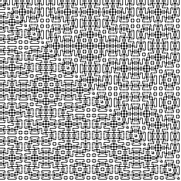

# Bitlang

Bitlang is a tiny stack-based DSL written in ANSI-C,
designed for the sole purpose of producing procedurally
generated 1-bit art.

## Sample

In bitlang, this expression:

    x y + abs x y - abs 1 + ^ 2 << 3 % !

Can be used to generate the following image:

## Building

Bitlang and the example program can be built running the
`build.sh` script. In addition to building the program,
this script will tangle the bitlang program using a local
version of Worgle.

Running this program will generate a PBM file, which can
be converted to a PNG file using imagemagick.

The files for bitlang (bitlang.c, bitlang.h) can be tangled
with:

    gcc -DWORGLITE worgle.c -o worglite
    ./worglite -g -Werror bitlang.org

## Language Overview

Bitlang is a stack-based language, similar to RPN
calculators and programs like dc.

    2 3 +

Adds 2 and 3 together and pushes 5 onto the stack.

Special variables x, y, w, h, and t correspond to
XY position, width, height, and time (as a frame number).

The following operations are currently supported:

Basic arithmetic: +, -, *, /

Modulo: %

Left/right shift: <<, >>

Equals operation: =

Logical and Bitwise OR: ||, |

Bitwise AND: &

XOR: ^

Logical and Bitwise NOT: !, ~

Absolute Value: abs

## Using Bitlang

Bitlang tangles out into 2 files `bitlang.c` and
`bitlang.h`. These can be dropped.

For API usage, see [example.c](./example.c).

## Woven HTML Output

Bitlang is written in a literate style. The woven HTML
component can be found and read [here](https://pbat.ch/loom/bitlang).